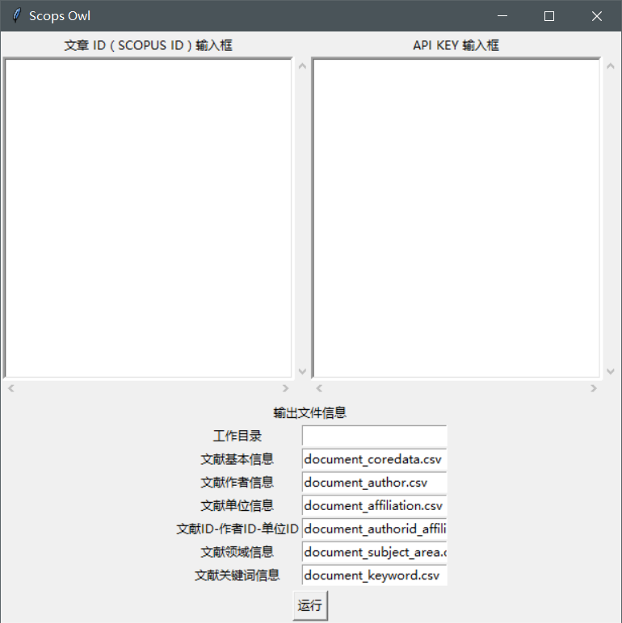

# Scops_owl #

## 描述 ##

[**Scopus**](https://www.scopus.com) is a database containing bibliographic information of scientific research articles.

[**Scops owl**](https://en.wikipedia.org/wiki/Scops_owl) is the common name of some owl species belonging to genus *Otus*.

(By Eadgbe - Own work, Public Domain, https://commons.wikimedia.org/w/index.php?curid=2733492)

The python scripts in [**scops_owl**](https://github.com/wolfsonliu/scops_owl) are used to fetch data for analysis from the Scopus database.

## 依赖需求 ##

该软件由 [Python 3](https://www.python.org/) 开发，依赖于 [numpy](http://www.numpy.org/)，[pandas](http://pandas.pydata.org/)，
[time](https://docs.python.org/3.6/library/time.html)，[logging](https://docs.python.org/3/library/logging.html?highlight=logging#module-logging)，
[requests]()，[urllib3]()，[tkinter](https://docs.python.org/3/library/tkinter.html)

## 安装说明 ##

## 使用说明 ##

### 开始界面 ###

开始界面由两部分组成，上面的一部分为工具按钮，下面的一部分为运行记录框。

工具按钮栏中有 Scops Owl 所具有的基本功能，现在包括：
* 获取作者和单位文献列表
* 获取文献的基本信息
* 获取作者基本信息
* 获取单位基本信息

### 获取作者和单位文献列表 ###

该功能面板上半部分为基本的 ID 输入框：
* 单位 ID 输入框：输入单位的 ID，需要和作者 ID 一一对应
* 作者 ID 输入框：输入作者的 ID，需要和单位 ID 一一对应
* API KEY 输入框：输入一系列 SCOPUS API key，由于每一个 API 有限额，所以建议输入多个，当一个 API 限额不足的时候可以自动更更换新的 API KEY

下半部分为选择年份，及设定输出文件名称的框。
工作目录的输入框如果是空的话则是当前软件运行目录，或者也可以填写相应的目录。
文件名输入框则是指定输出文件的名称，会保存在工作目录中，输出文件均为 csv 格式表格。
点击运行按钮则可以运行程序。

输出的为三个文件：
1. 作者 ID - 文献 ID 文件：输出文件有两列，作者的 ID（author_id）和其相应的文献的 ID（scopus_id），如果一个作者有多个文献，则会有多行数据。
2. 文献 ID - 单位文件：输出文件有四列，包括文献 ID（scopus_id）、单位名称（affiliation_name）、
  单位所在城市（affiliation_city）和单位所在国家（affiliation_country）。同样，如果一个文献有过个单位则会有多行数据。
3. 文献基本信息：输出文献本身的基本信息，包括文献 ID（scopus_id，article_number）、文献题目（title）、文献 EID（eid）、
  被引频次（citedby_count），第一作者（creator），集合类型（aggregationType），日期（coverDate），显示日期（coverDisplayDate），
  文献 DOI（doi），文献 eISSN（eIssn），文献 ISSN（issn），issue（issueIdentifier），页码（pageRange），
  出版社（publication），统一资源定位器（url），卷（volume），亚类（subtype），亚类名称（subtype_description）

### 获取文献基本信息 ###

该功能是通过文献的 ID 去获取文献的基本信息。

面板上半部分为基本的 ID 输入框：
* 文章 ID 输入框：输入文章的 SCOPUS ID，每行一个文献
* API KEY 输入框：输入一系列 SCOPUS API key，由于每一个 API 有限额，所以建议输入多个，当一个 API 限额不足的时候可以自动更更换新的 API KEY

面板下半部分为工作目录和输出文件名输入框：
* 文献基本信息：输出文件为文献本身的基本信息，文献 ID（scopus_id），文献 eid（eid），PUBMED ID（pubmed_id），pii（pii），
  文献 DOI（doi），文献名称（title），集合类型（aggregation_type），（srctype），引用频次（citedby_count），出版社（publication_name），
  （source_id），文献 ISSN（issn），卷（volumn），（issue_identifier），起始页码（start_page），结束页码（end_page），
  页码范围（page_range），日期（cover_date）
* 文献作者信息：输出文件为文献的作者信息，文献 ID（scopus_id），作者 ID（author_id），索引姓名（idxname），作者名（initialname），
  作者姓（surname），作者排名（rank）。如果作者有多个，则对应多行数据
* 文献单位信息：输出文件为文献的单位信息，文献 ID（scopus_id），单位 ID（affiliation_id），单位名称（affiliation_name），
  单位所在城市（affiliation_city），单位所在国家（affiliation_country）。如果单位有多个，则对应多行数据
* 文献 ID - 作者 ID - 单位 ID：输出文件为文献 ID（scopus_id），作者 ID（author_id）和单位 ID（affiliation_id）的三个关系对应表。
* 文献领域信息：输出文件为该文献的分类领域，文献 ID（scopus_id），领域编号（code），领域缩写（abbrev），领域名称（description）。
  如果领域有多个，则对应多行数据
* 文献关键词信息：输出文件为该文献的关键词，文献 ID（scopus_id），关键词（keyword）。如果关键词有多个，则对应多行数据

### 获取作者基本信息 ###

面板上半部分为基本的 ID 输入框：
* 作者 ID 输入框：输入作者的 AUTHOR ID，每行一个文献
* API KEY 输入框：输入一系列 SCOPUS API key，由于每一个 API 有限额，所以建议输入多个，当一个 API 限额不足的时候可以自动更更换新的 API KEY

面板下半部分为工作目录和输出文件名输入框：
* 作者基本信息：输出为作者本身的基本信息，作者 ID（author_id），作者 eid（eid），文献计数（document_count），被引频次（cited_by_couunt），
  引用频次（citation_count），现单位 ID（affiliation_current），作者姓（surname），作者索引姓名（idxname），作者名（initialname），
  作者名2（givenname）
* 作者领域：输出为作者的领域划分，作者 ID（author_id），领域编号（code），领域缩写（abbrev），领域名称（subject_area）。
  如果领域有多个，则对应多行数据
* 文献单位信息：输出文件为作者的所有有记录的单位信息，作者 ID（author_id），单位 ID（affiliation_id），上级单位 ID（parent_id），
  单位名称（affiliation_name），上级单位名称（parent_name），单位所在城市（affiliation_city），单位所在省份（affiliation_state），
  单位所在国家（affiliation_country），单位邮编（affiliation_zipcode），单位地址（affiliation_address），单位类型（affiliation_type）。
  如果单位有多个，则对应多行数据

### 获取单位基本信息 ###

面板上半部分为基本的 ID 输入框：
* 单位 ID 输入框：输入单位的 AFIL ID，每行一个文献
* API KEY 输入框：输入一系列 SCOPUS API key，由于每一个 API 有限额，所以建议输入多个，当一个 API 限额不足的时候可以自动更更换新的 API KEY

面板下半部分为工作目录和输出文件名输入框：
* 单位基本信息：输出文件为单位的基本信息，单位 ID（affiliation_id），单位名称（affiliation_name），单位地址（address），
  单位所在城市（city），单位所在国家（country），单位 eid（eid），作者计数（author_count），文献计数（document_count），
  单位类型（type），单位域名（domain），单位统一资源定位器（url）

## 信息 ##

* Author: Wolfson Liu <wolfsonliu@gmail.com>
* Time: 20171220
* Version: 0.1.20171220
* License: GPL 3