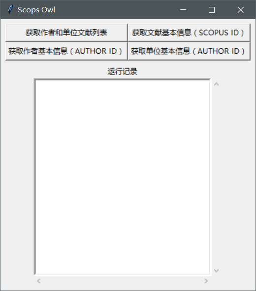
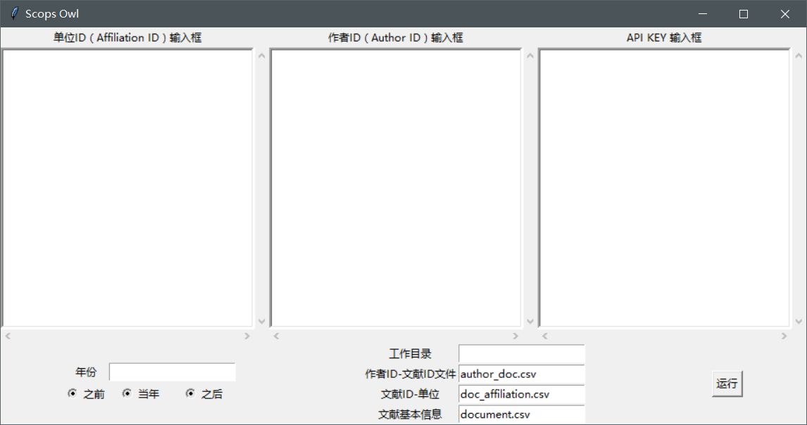

# Scops_owl #

## 描述 ##

[**Scopus**](https://www.scopus.com) is a database containing bibliographic information of scientific research articles.

[**Scops owl**](https://en.wikipedia.org/wiki/Scops_owl) is the common name of some owl species belonging to genus *Otus*.

(By Eadgbe - Own work, Public Domain, https://commons.wikimedia.org/w/index.php?curid=2733492)

The python scripts in [**scops_owl**](https://github.com/wolfsonliu/scops_owl) are used to fetch data for analysis from the Scopus database.

## 依赖需求 ##

## 安装说明 ##

## 使用说明 ##

### 开始界面 ###

开始界面由两部分组成，上面的一部分为工具按钮，下面的一部分为运行记录框。

工具按钮栏中有 Scops Owl 所具有的基本功能，现在包括：
* 获取作者和单位文献列表
* 获取文献的基本信息
* 获取作者基本信息
* 获取单位基本信息

### 获取作者和单位文献列表

该功能面板上半部分为基本的 ID 输入框：
* 单位 ID 输入框：输入单位的 ID，需要和作者 ID 一一对应

## 信息 ##

* Author: Wolfson Liu
* Time: 20171220
* Version: 0.1.20171220